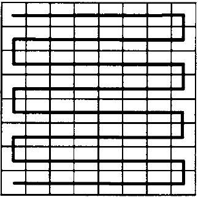
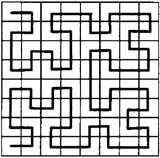
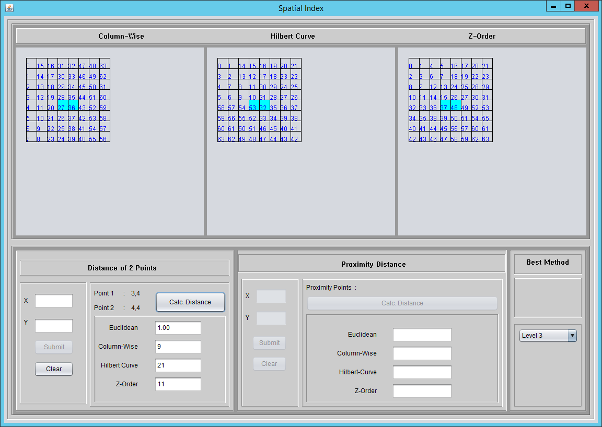
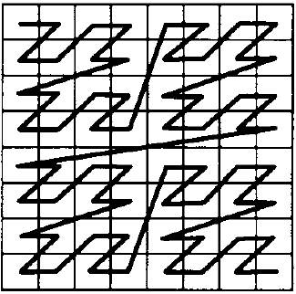
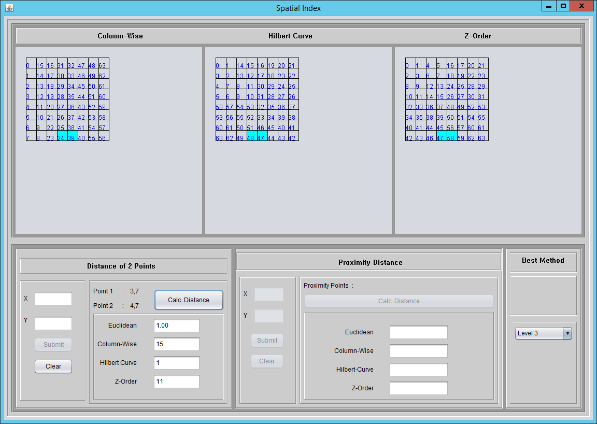
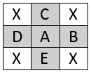
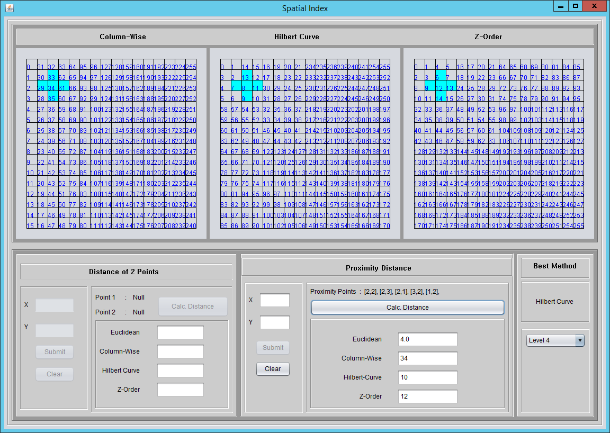
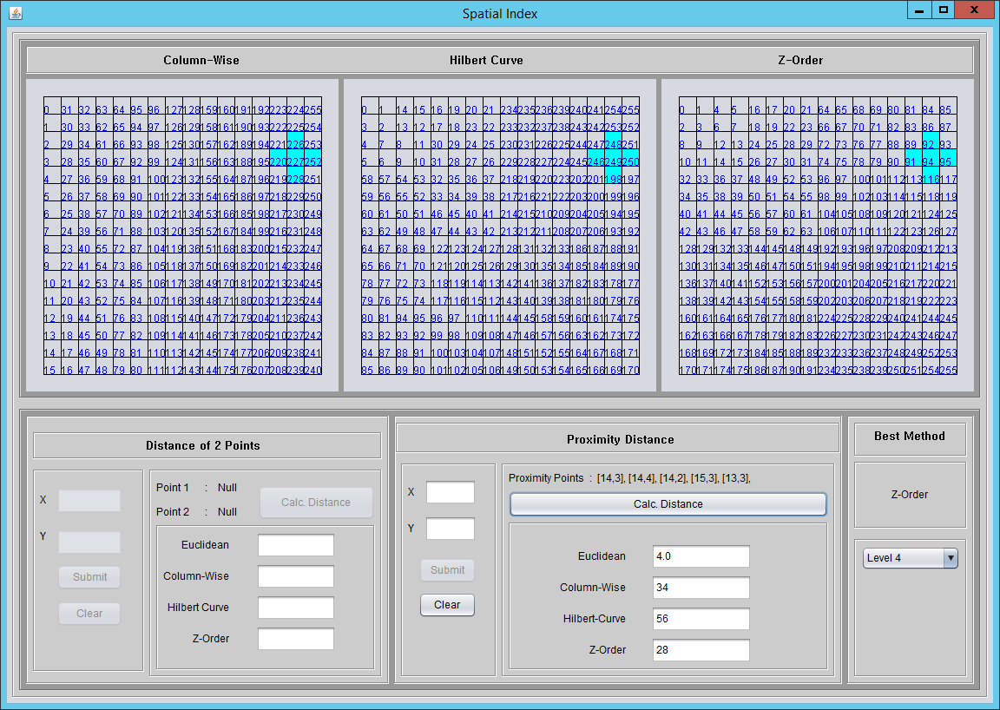

# Spatial Index with Proximity Analysis

###I created this code from the scratch for understanding how the spatial index works. The analysis is explained as follow:

Spatial database stores information related to objects in space. Because the objects are commonly in a multi-dimensional form, it’s necessary to map a multidimensional space onto a one-dimensional space. The indexing goal is to order the points in such a way that points that are near each other in space are near each other in the index. The most common spatial index methods namely Column-wise, Hilbert-curve, and Z-Order. All of those methods have advantages and disadvantages in particular condition. Hence, this study aims to elaborate them.
### 1. Column-Wise
Column-wise is very simple technique. Suppose space as a raster image; it scans a raster image across the column of the pixel. Unfortunately, it has problems in half of the start-points, the close points at half of the row-firsts are quite distant on the path. As shown in fig. 1, the pair points located in the red rectangle are quite distant, even though those locations are quite close each other, and so is the green, yellow and blue rectangle.

Based on experiment result in fig. 2 below, the points 0,0 and 1,0 according to Euclidean distance are very close, its value is 1. However, it contradicts with Column-wise technique yielding distance 15. In this case Hilbert curve and Z-Order technique is better.

### 2. Hilbert-curve
Hilbert-curve ordering relates to the Morton ordering as the row-prime to the row ordering. This technique is well known more ingenious than Column-wise. Even though it is better in preserving the nearness; it also has shortcomings at the certain point as shown in fig. 3 below. The pair points located in rectangle color are ordered distantly each other. 

One of the above examples is shown in below figure. This figure illustrates that points in coordinates 3,4 and 4,4 are revealed distant each other by Hilbert-curve, the distance is 21, however, based on Euclidean, the distance is solely one. If we compare with other techniques, Column-wise is the best technique (9) while Z-Order is 11. 

### 3. Z-Order
Z-Order sorts the pixels based on recursive ‘Z’ at various types. This technique also better in preserving proximity than Column-wise technique. However, same as Hilbert-curve technique, it also has a drawback in certain point as depicted in figure 5. The pair points located in color rectangle are ordered distantly each other, even though intuitively they are close each other.

Figure 6 below shows that points with coordinates 3,7 and 4,7 are indexed distantly one another based on Z-Order. However, intuitively and based on the Euclidean distance they are close one another. If we compare with Column-wise and Hilbert-curve (15), Hilbert-curve(1) technique is the best method in this case.

### A Big jump Problem
Another disadvantage of Z-Order technique, it has “big jump” order. Z-Order tends to index the two distant points as near point. As illustrated in figure 7, the pair colored points are revealed close each other, but actually, they are located in a distant location.

Based on figure 8 below, the distance of points with coordinates 7,3 and 0,4 are indexed be near point based on Z-Order technique, however intuitively and based on the Euclidean; they are distant apart.

### A Proximity Distance
Proximity distance is obtained by calculating the distance from the center of the input point to all other neighbor coordinates. E.g., the point A in the matrix below has neighbor points B, C, D and E. Whereas the distance is derived from the total distance from A to B, A to C, A to D and A to E. And the lowest total distance represents the best method. 

The following experiment uses input point coordinates [2,2] while the neighbor points are [2,3], [2,1], [3,2], and [1,2]. Euclidean distance yields 4 because all of 4 points distance is 1 such that the total distance is 4, Column-wise yields 34, Hilbert-curve 10 and Z-Order 12. Hence from all of the approaches, Hilbert-curve is the best method preserving proximity in this case.

Figure 10 depicted experiment by using point [14,3] as input, whereas the proximity points are [14,4], [14,2], [15,3], and [13,3]. In this case, the best method preserving proximity is Z-Order (28), while other approaches have higher distance value, Column-wise (34), and Hilbert-curve (56).

### Conclusion
Overall, Hilbert-curve and Z-Order is better approach in preserving proximity than Column-wise approach. Because Z-Order has big jump cases, it means it has more drawbacks if we compare with Hilbert-curve. Hence the best approach is Hilbert-curve. Moreover, through algebraic analysis, and through computer simulation, the Hilbert-curve performed as well as or better than Column-wise or Z-Order [1].

### Reference
[1]. Jagadish, H.V, “Linear Clustering of Objects with Multiple Attributes,” AT&T Bell Laboratories,
Murray Hill, New Jersey. http://web.eecs.umich.edu/~jag/papers/J90.pdf

